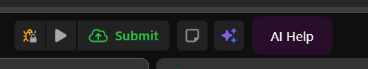
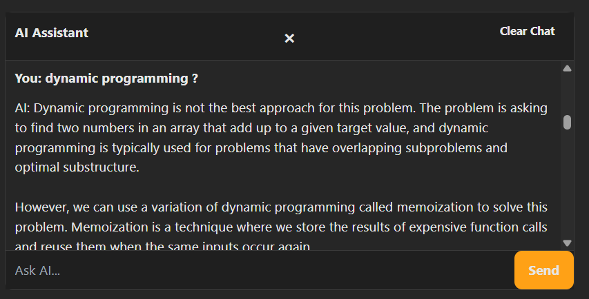
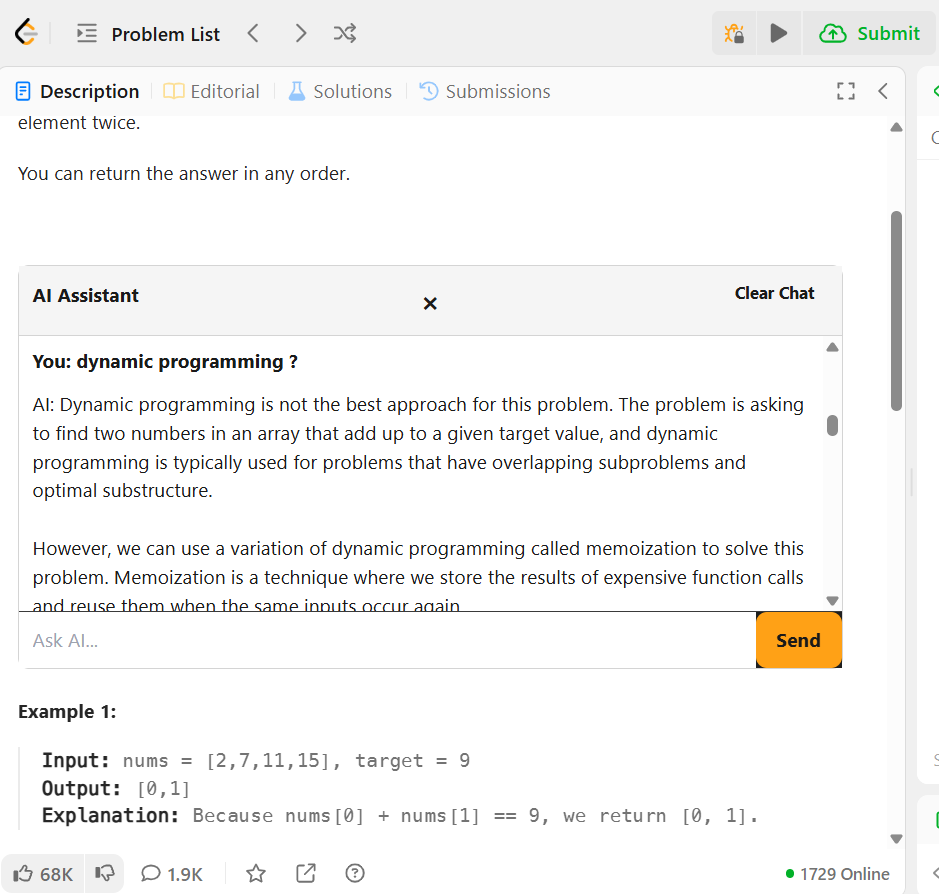
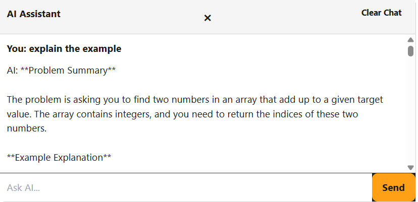

# LeetCode AI Helper Extension

A Chrome extension that provides AI-powered assistance for solving LeetCode problems. Instead of giving direct answers, it acts as a mentor that guides you through problem-solving with hints and explanations.

## Features

- **AI Chat Assistant** - Ask questions about any LeetCode problem directly on the page
- **Context-Aware** - Automatically captures the problem description, examples, and your current code
- **Mentorship Approach** - Provides gradual hints instead of direct solutions
- **Dark/Light Theme** - Automatically adapts to LeetCode's theme
- **Conversation History** - Saves chat history per problem using Chrome storage
- **Powered by Groq** - Uses Llama 3.1 8B for fast, intelligent responses

## Screenshots

### AI Help Button


### Chat Interface (Dark Mode)


### Chat Interface (Light Mode)


### Explain example


## Installation

1. Clone or download this repository
   ```bash
   git clone https://github.com/yourusername/Leetcode-AI-Helper.git
   ```

2. Get a free API key from [Groq Console](https://console.groq.com/)

3. Open Chrome and navigate to `chrome://extensions/`

4. Enable **Developer mode** (toggle in top right)

5. Click **Load unpacked** and select the project folder

6. Click the extension icon in Chrome toolbar and enter your Groq API key

7. Navigate to any LeetCode problem and click the **AI Help** button

## Usage

1. Go to any problem page on [leetcode.com](https://leetcode.com)
2. Click the green **AI Help** button in the top right
3. A chatbox will appear below the problem description
4. Type your question and press **Send**
5. The AI will provide hints and guidance based on the problem context and your code

### Example Questions
- "How should I approach this problem?"
- "What data structure would be best here?"
- "Why is my solution getting TLE?"
- "Can you explain the two-pointer technique?"
- "What am I missing in my code?"

## Project Structure

```
Leetcode-AI-Helper/
├── manifest.json      # Chrome extension configuration
├── background.js      # Service worker - handles API calls
├── content.js         # Injects UI into LeetCode pages
├── context.js         # Extracts problem context from page
├── storage.js         # Manages conversation history
├── popup.html         # Extension popup UI
├── popup.js           # Popup logic - saves API key
├── prompt.txt         # System prompt for AI behavior
└── assets/
    └── icon.jpg       # Extension icon
```

## Configuration

### Changing the AI Model
Edit `background.js` to use a different Groq model:
```javascript
model: "llama-3.1-8b-instant"  // Change to another model
```

### Customizing AI Behavior
Edit `prompt.txt` to modify how the AI responds to questions.

## Tech Stack

- **Chrome Extension Manifest V3**
- **Groq API** with Llama 3.1 8B Instant
- **Vanilla JavaScript** (no frameworks)
- **Chrome Storage API** for persistence

## Contributing

1. Fork the repository
2. Create a feature branch (`git checkout -b feature/amazing-feature`)
3. Commit your changes (`git commit -m 'Add amazing feature'`)
4. Push to the branch (`git push origin feature/amazing-feature`)
5. Open a Pull Request


## Acknowledgments

- [Groq](https://groq.com/) for the fast AI inference API
- [LeetCode](https://leetcode.com/) for being an awesome platform


## Happy Coding

Pranto Bala

Computer Science and Engineering

Jashore University of Science and Technology


